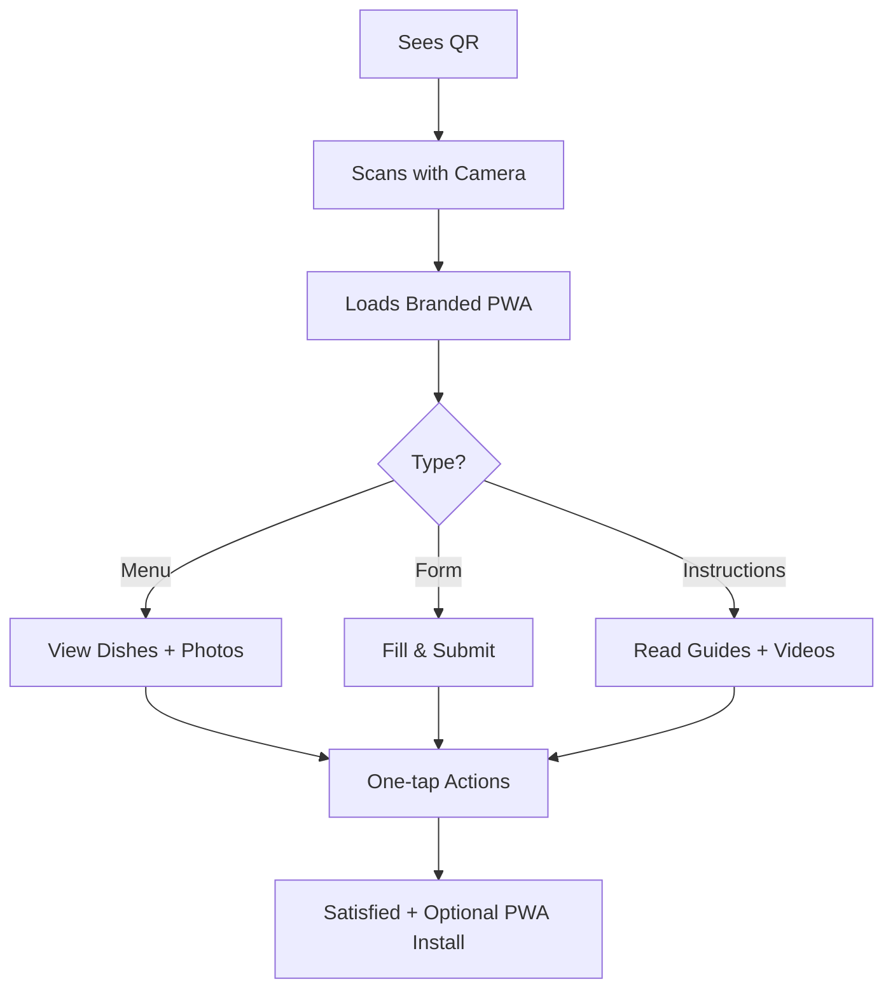

# Customer Journey - Qriza

Qriza has two distinct customer types:

- **Business Owner** (the paying SaaS customer — hotel owner, sweet shop manager, electronics store, etc.)
- **End Customer** (the person who scans the QR code — guest, buyer, visitor)

---

## A. Business Owner Journey (SaaS User)

### Stages

#### 1. Discovery & Sign-up
Finds Qriza via search, ad, or referral → Visits landing page → Signs up with email/Google → Creates organization.

#### 2. Onboarding
Chooses industry template (Hotel, Sweet Shop, Electronics, etc.) → AI helps generate initial menu/form → Quick tour of dashboard.

#### 3. Content Creation
Builds menu / form / instruction page using drag-and-drop + AI generator → Uploads photos/logo → Previews on mobile.

#### 4. QR Deployment
Generates branded QR → Downloads print-ready versions → Places QR on tables, products, receipts, rooms.

#### 5. Active Usage & Optimization
Monitors real-time analytics → Updates content instantly → Receives form submission notifications → Upgrades plan if needed.

#### 6. Retention & Advocacy
Renews subscription → Invites team members → Refers other businesses → Becomes power user (custom domain, white-label).

### Key Emotions & Pain Points

| Emotion | Details |
|---------|---------|
| **Excitement** | During onboarding |
| **Frustration** | If content builder is slow |
| **Delight** | When they see analytics and instant updates |
| **Loyalty** | When AI saves them hours every week |

---

## B. End Customer Journey (QR Scanner)

### Stages (Core Value of Qriza)

#### 1. Awareness
Sees physical QR (table tent, product tag, hotel room card, sweet shop counter).

#### 2. Scan
Opens phone camera → Scans → Instant redirect to branded PWA page (no app install required).

#### 3. Engagement
- Views rich menu with photos, prices, allergens
- Reads step-by-step instructions (electronics setup, hotel rules)
- Fills form (feedback, service request, warranty)

#### 4. Action
Submits form → Gets confirmation → One-tap WhatsApp/call → Optionally installs PWA for future visits.

#### 5. Post-Interaction
Leaves satisfied, shares experience, or returns later with saved content (offline support).

### Key Emotions

- 😊 **Surprise & Delight** at how smooth and beautiful it is
- ✅ **Trust** when content matches the brand
- ⚡ **Convenience** (no waiting for waiter, instant manual access)

---

## End Customer Journey Flow

